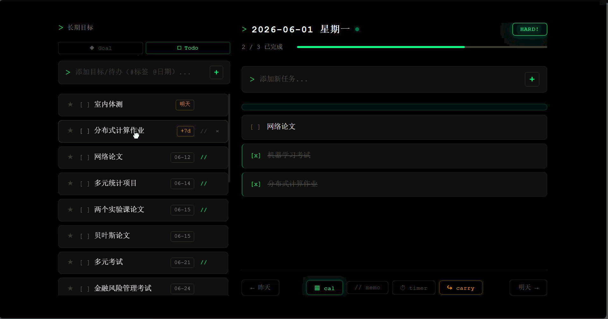
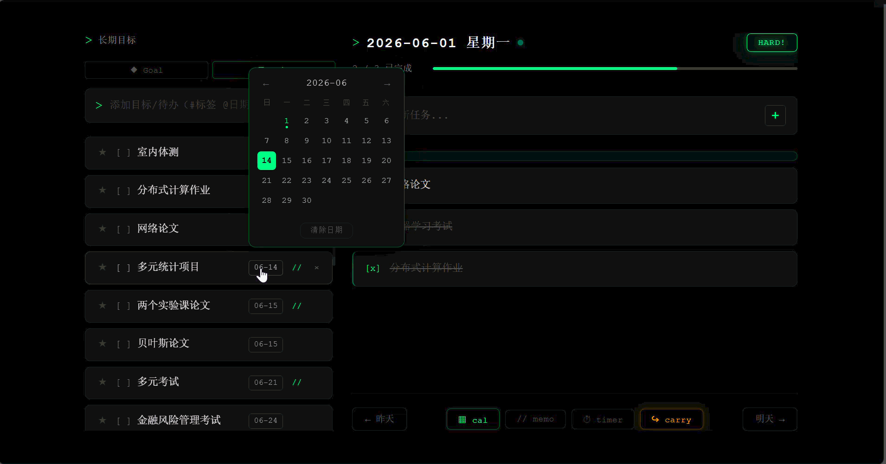
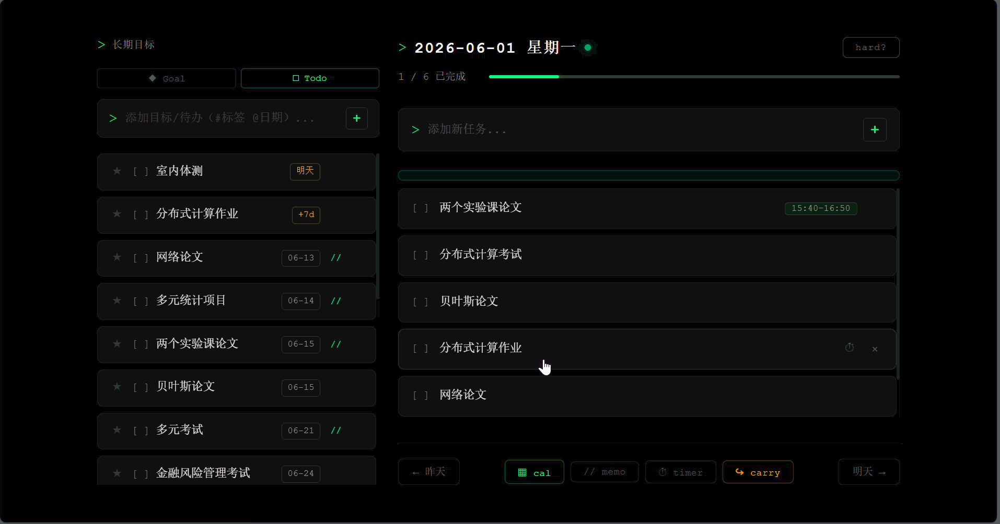

# 每日规划 Daily Plan

一个极简风格的本地日程管理工具，支持每日任务、长期目标、备忘录和计时器。

---

## 功能演示

**从长期目标拖拽到每日任务**
> 在左侧目标列表中，将目标直接拖入右侧当日任务



---

**目标日期管理与计时器**
> 为长期目标设置截止日期，使用内置计时器专注工作



---

**未完成任务延续到第二天**
> 一键将今日未完成的任务递延到明天，不遗漏



---

**Workhard 标注**
> 标记今天是否努力了，日历中一目了然


---

## 更多功能

- 任务支持标签、时间段、子任务
- 每日备忘录
- 日历视图，跨日期浏览历史
- 数据全部存储在本地，不联网

## 环境要求

- Python 3.10 或更高版本
- Windows 系统

## 安装

**1. 克隆项目**

```bash
git clone https://github.com/yanjunlin828-dotcom/Daily_Plan.git
cd Daily_Plan
```

**2. 安装 Python 依赖**

```bash
pip install -r backend/requirements.txt
```

## 启动

**方式一：双击快捷方式（推荐）**

右键 `backend/start_silent.vbs` → 发送到 → 桌面快捷方式，之后双击桌面图标即可。

- 首次启动自动创建数据库，无需额外配置
- 再次双击时，若服务已在运行则直接打开浏览器

**方式二：命令行**

```bash
cd backend
uvicorn main:app --host 0.0.0.0 --port 8000
```

然后在浏览器打开 [http://localhost:8000](http://localhost:8000)

## 数据存储

所有数据保存在 `backend/data.db`（SQLite），首次启动自动生成。备份只需复制这一个文件。
